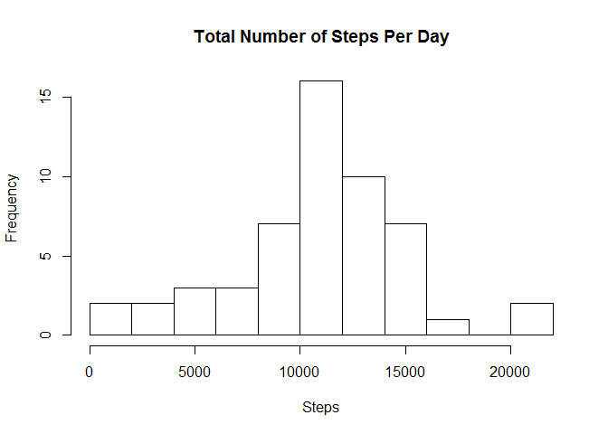
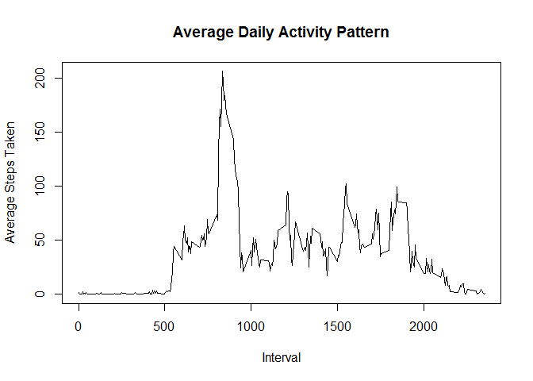
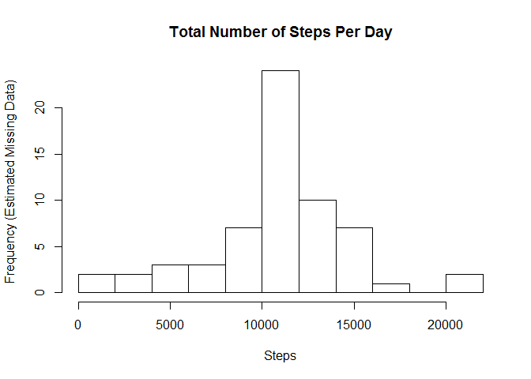

# Reproducible Research: Peer Assessment 1

## Loading and preprocessing the data

Read in the data from a .csv file. Convert the date column to objects of class Date.


```r
unzip("activity.zip")
dat <- read.csv("activity.csv", header=TRUE, stringsAsFactors=FALSE)
dat$date <- as.Date(dat$date)
```

## What is the mean total number of steps taken per day?

Make a histogram of the total number of steps taken each day.


```r
totalSteps <- aggregate(dat$steps, list(dat$date), sum)
names(totalSteps) <- c("date", "steps")
hist(totalSteps$steps, 10, main="Total Number of Steps Per Day", xlab="Steps")
```

 

The mean number of steps taken per day is


```r
mean(totalSteps$steps, na.rm=TRUE)
```

```
## [1] 10766.19
```

The median number of steps taken per day is


```r
median(totalSteps$steps, na.rm=TRUE)
```

```
## [1] 10765
```

## What is the average daily activity pattern?

Make a time series plot of the 5-minute interval and the average number of steps taken, averaged across all days.


```r
avgInterval <- aggregate(dat$steps, list(dat$interval), mean, na.rm=TRUE)
names(avgInterval) <- c("interval", "steps")
plot(avgInterval$interval, avgInterval$steps, type="l", main="Average Daily Activity Pattern", xlab="Interval", ylab="Average Steps Taken")
```

 

The interval with the highest average number of steps was the 104th interval of the day which began at minute 835. The average number of steps taken during this interval was 206.2


```r
which.max(avgInterval$steps)
```

```
## [1] 104
```

```r
avgInterval$interval[which.max(avgInterval$steps)]
```

```
## [1] 835
```

```r
max(avgInterval$steps)
```

```
## [1] 206.1698
```

## Imputing missing values

There are 2,304 intervals with an unknown number of steps taken


```r
sum(is.na(dat$steps))
```

```
## [1] 2304
```

Fill in the missing values with the mean number of steps for that interval using all other days that do have data.


```r
datFilled <- dat
for (i in 1:nrow(datFilled)) {
    if (is.na(datFilled$steps[i])) {
        currentInterval <- datFilled[i,3]
        whichInterval <- which(avgInterval[,1] == currentInterval)
        datFilled[i,1] <- avgInterval[whichInterval,2]
    }
}
```

The data set no longer has NA values


```r
sum(is.na(datFilled$steps))
```

```
## [1] 0
```

Estimating the missing data points has a small impact on the histogram. The column with the highest frequency number of steps is the only column with a changed value.


```r
totalStepsFilled <- aggregate(datFilled$steps, list(datFilled$date), sum)
names(totalStepsFilled) <- c("date", "steps")
hist(totalStepsFilled$steps, 10, main="Total Number of Steps Per Day", xlab="Steps", ylab="Frequency (Estimated Missing Data)")
```

 

The mean for the new dataset is unchanged:


```r
mean(totalStepsFilled$steps)
```

```
## [1] 10766.19
```

The median for the new dataset increased slightly:


```r
median(totalStepsFilled$steps)
```

```
## [1] 10766.19
```

## Are there differences in activity patterns between weekdays and weekends?

Create a new factor variable with the type of day - weekday or weekend


```r
datWeek <- datFilled
datWeek$day <- weekdays(as.Date(datWeek$date))
weekendDays <- c("Saturday","Sunday")
for (i in 1:nrow(datWeek)) {
    if (is.na(match(datWeek[i,4], weekendDays))) {
        datWeek[i,4] <- "weekday"
    } else {
        datWeek[i,4] <- "weekend"
    }
}
datWeek$day <- factor(datWeek$day, levels = c("weekday","weekend"))
```

Make a panel plot with the time series plot of the 5-minute interval for weekdays vs. weekends 


```r
stepsDay <- aggregate(steps ~ interval + day, datWeek, mean)
library(lattice)
xyplot(steps ~ interval | day, datWeek, layout = c(1, 2), xlab = "Interval", ylab = "Average number of steps", type = "l")
```

 

On weekdays, activity is higher in the morning. The number of steps is more balanced throughout the day on weekends.
